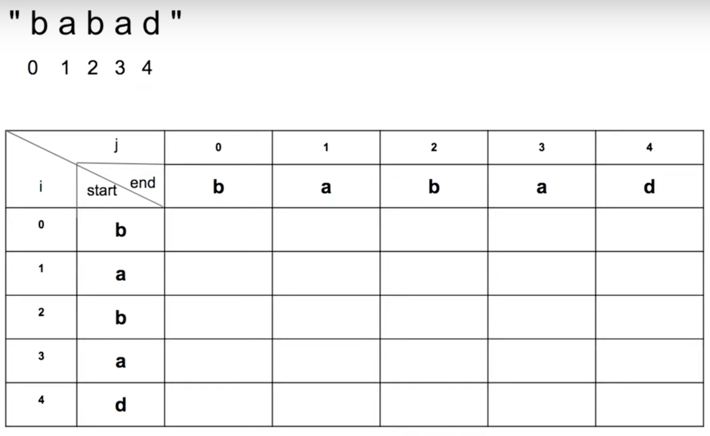
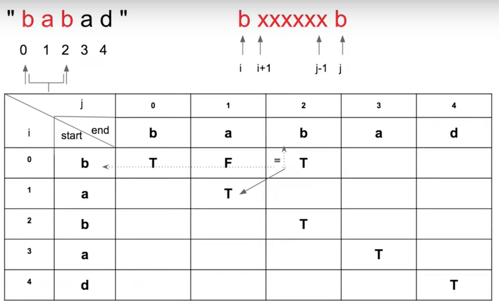
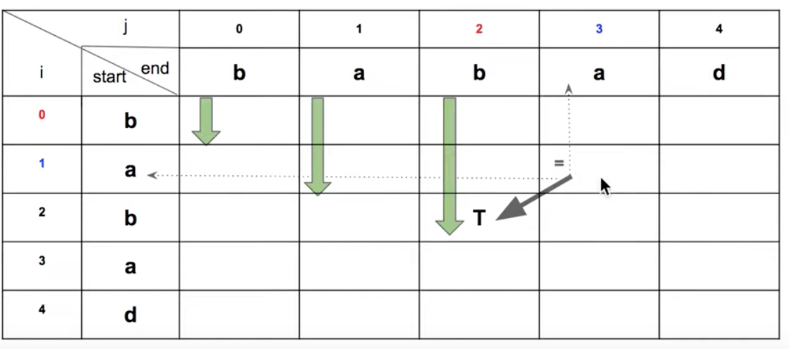

# Longest Palindromic Substring

- Leetcode: [5. Longest Palindromic Substring](https://leetcode.com/problems/longest-palindromic-substring/)
- My solution: [kaka-lin/leetcode/00005_longest-palindromic-substring](https://github.com/kaka-lin/leetcode/blob/main/leetcode/00005_longest-palindromic-substring/5-longest-palindromic-substring.py)

The detail of explain of solution please see as below.

```
思路與解法說明請看下面。
```

## Question

Given a string `s`, return *the longest palindromic substring* in `s`

##### Example 1:

```
Input: s = "babad"
Output: "bab"
Explanation: "aba" is also a valid answer.
```

##### Example 2:

```
Input: s = "cbbd"
Output: "bb"
```

##### Constraints:

- `1 <= s.length <= 1000`
- `s` consist of only digits and English letters.

## Solution

- [Method 1: Brute-Force](#method-1-brute-force-time-limit-exceeded)
- [Method 2: Dynamic Programming](#method-2-dynamic-programming)
- [Method 3: Expand Around Center](#method-3-expand-around-center)

### Method 1: Brute-Force (Time Limit Exceeded)

Pick all possible starting and ending positions for a substring,
and verify if it is a palindrome.

```
窮舉所有可能的 Substring，判斷其是否為回文
```

```python
def longestPalindrome(s):
    if not s: return ""

    n = len(s)
    left, right, longest = 0, 0, 0
    for i in range(n):
        for j in range(i + 1, n + 1):
            substr = s[i:j]
            if isPalindrome(substr):
                if len(substr) > longest:
                    left, right, longest = i, j, len(substr)
    return s[left:right]
```

其中判斷是否為回文的方法為:

```python
def isPalindrome(s):
    l, r = 0, len(s) - 1
    while l < r:
        if s[l] != s[r]:
            return False
        l += 1
        r -= 1
    return True
```

- Time-Complexity: $O(n^3)$, `Time Limit Exceeded`

### Method 2: Dynamic Programming

[Python code](#implementing-with-python) 直接看這邊。

#### Step 1. Characterize an OPT Solution

- Subproblems:

    - if s[i~j] is a palindrome, s[i+1~j-1] is also a palindrome.

        $$P(i,j) = (P(i+1,j−1)\ and\ S[i] == S[j])$$

- Optimal substructure: suppose we already knew that substr `"bab"` is a palindrome:
  - Case 1: `"ababa"` must be a palindrome

    因為左右兩端的字母是一樣的

  - Case 2: `"bbabc"` is not a palindrome

    因為左右兩端的字母不是一樣的

#### Step 2: Recursively Define the Value of an OPT Solution

- Base case:
  - Odd: $P(i, i) = True$
  - Even: $P(i, i+1) = (S[i] == S[i+1])$

    Example:

    ```
    odd: abcba
           i

    even: a b c c b a
              i i+1
    ```

- Recursive case: $P(i,j) = (P(i+1,j−1)\ and\ S[i] == S[j])$

    ```
    Substring is a palindrome and the two left and right end letters are the same
    ```

#### Step3: Compute Value of an OPT Solution

##### Bottom-Up Tabulation

1. 建立一個 `N x N` 的表格，如下所示:

    
    

2. Preporcessing: Base case

    在表格中，先填上 Base case 的值 (奇數與偶數情況)，如下圖所示:

    
    

3. Compute Value

    - Recursive Case:

        $$P(i,j) = (P(i+1,j−1)\ and\ S[i] == S[j])$$

    假設 S[i~j] 為回文，那個 S[i+1~j-1] 也必然為回文，依照表格去尋找相對應的值，判斷是否為回文，如下圖所示:

    
    

##### 表格 loop 方向

因為 P(i,j) 需要往回查看 P(i+1, j-1)，所以我們這邊採用`『由上而下由左而右』`的方式進行搜索，如下圖所示:




#### Implementing with Python

```python
# Bottom-Up with Tabulation
def longestPalindrome(s):
    n = len(s)
    left = right = 0
    max_length = 0
    p_dp = [[0] * n for _ in range(n)]

    # Base case: Odd
    for i in range(n):
        p_dp[i][i] = True
        max_length = 1
        left = i
        right = i+1

    # Base case: Even
    for i in range(n-1):
        if s[i] == s[i+1]:
            p_dp[i][i+1] = True # base case
            max_length = 2
            left = i
            right = i+2

    # Recursive case:
    # P(i,j) = P(i+1,j−1) and S[i] == S[j]
    # 採用『由上而下由左而右』進行搜索。
    for j in range(n): # End
        for i in range(j-1): # Start
            if s[i] == s[j] and p_dp[i+1][j-1]:
                p_dp[i][j] = True
                if j - i + 1 > max_length:
                    left = i
                    right = j+1
                    max_length = j - i + 1

    return s[left:right]
```

### Method 3: Expand Around Center

In fact, we could solve it in O(n^2) time using only constant space.

因為回文特性是繞著中心鏡像出去，所以我們可以從中心擴展(Expand)出去，如下圖所示:


#### Implementing with Python

從中心擴展:

```python
# get the longest palindrome, l, r are the middle indexes
# from inner to outer
def palindromeAt(s, l, r):
    while l >= 0 and r < len(s) and s[l] == s[r]:
        l -= 1
        r += 1

    return s[l+1:r]
```

分別考慮奇數與偶數的情況，別且都從中心擴展查找最長回文，
並且是比較看誰最長，如下:

```python
def longestPalindrome(s: str) -> str:
    ans = ""
    for i in range(len(s)):
        odd = palindromeAt(s, i, i) # 單數框
        even = palindromeAt(s, i, i+1) # 偶數框
        ans = max(ans, odd, even, key=len)
    return ans
```

## Refernece

- [[LeetCode]5. Longest Palindromic Substring 中文](https://www.youtube.com/watch?v=ZnzvU03HtYk)
- [花花酱 LeetCode 5. Longest Palindromic Substring - 刷题找工作 EP292](https://youtu.be/g3R-pjUNa3k)
- [[LeetCode Python] 5. Longest Palindromic Substring— Dynamic Programming](https://home.gamer.com.tw/artwork.php?sn=5315467)
