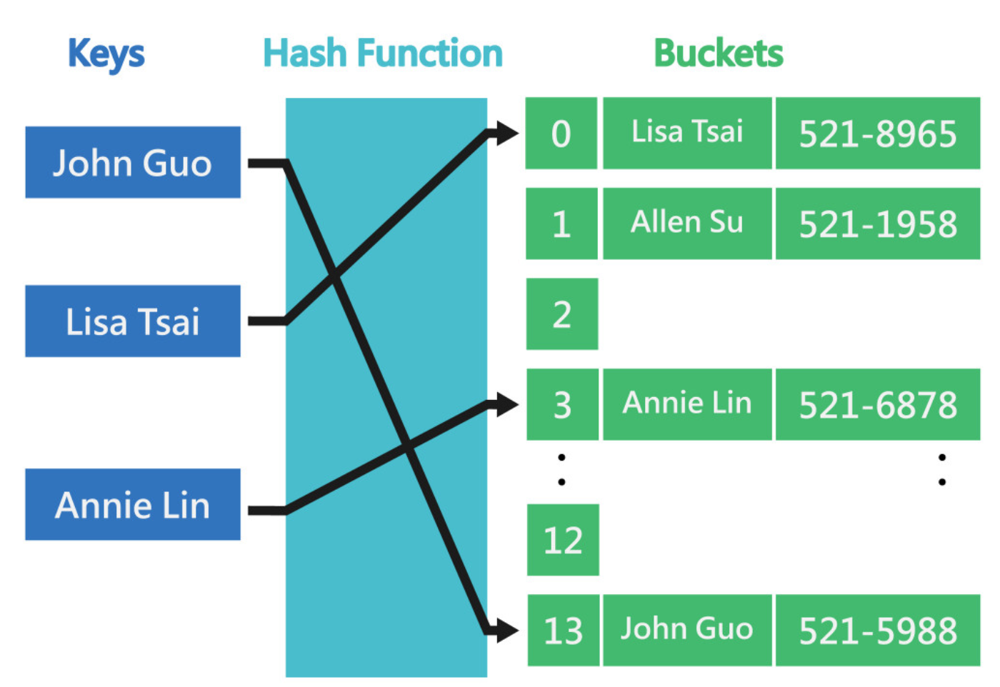
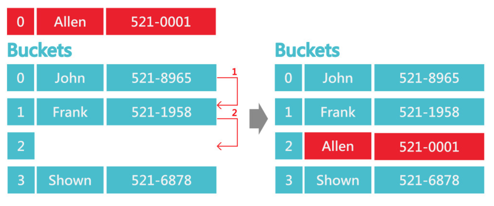
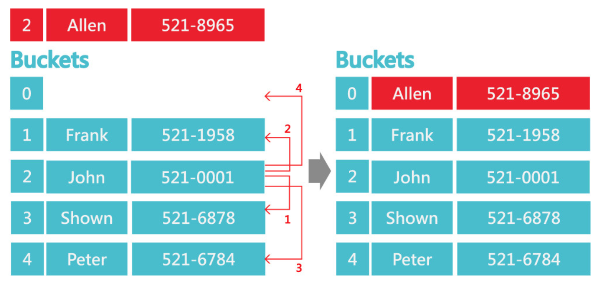

# Hash Table

Hash Table 就是儲存 (key, value) 這種 mapping 關係的一種資料結構。
它是透過 Hash Function 來計算出 key 與 value 所對應的位置，如下所示:




## 前言

在 prority queue 裡，我們在乎的是資料的大小(優先度)，
但今天我們不是在乎大小(優先度)，而是根據給定的 key 去做相應的處理，那我們就稱其為 `map` or `dictionary`。

- `map`:

    ```json
    { key: value }
    ```

    example:
    ```
    key1: value1
    key2: value2
    ```

- `dictionary`: { key, set(value) }

    ```json
    { key:  set(value) }
    ```

    example:
    ```
    key1: value1,1
          value1,2
          vaule1,3
    key2: value2,1
          value2,2
          vaule2,3
    ```

## Implement Hash Table data structure

在開始實作 Hash Table 前，我們先思考一下有沒有已經有的data structure 可以實作出相同的特性，以 map 來思考。

### 思考出發點: Using Array as Map

- Thinking 1. 假設 key 是 integer (small)

    - key as array index
    - value as array data

        | insert | get |
        | :-: | :-: |
        | O(1) | O(1) |


- Thinking 2. 假設 key 是很大的 integer

    需要很大的 array，`很浪費空間`。

- Thinking 3. 壓縮 key

    `壓縮空間`，如:

    ```
    將 10000 種 key 至空間大小為 100 的 array 內
    ```

- Thinking 4. key 不是 integer 時

    假設 key 不是 integer，而是 string 時，
    我們就需要 `conver string to integer`。

#### 結論

- 快速的 convert (convert to integer)
- 快速的 壓縮 key (small integer)
- 快速的 array operate

就可以達到快速的 map 的 implementation。


### 專有名詞介紹

Example:

```
insert (key, value) => A[h(key)] = value
get value by key => value = A[h(key)]
                            / \
                Bucket array  hash function
```

- 桶(Bucket array):

    雜湊表中儲存資料的位置，每一個位置對應唯一位址(Bucket Address)。

- perferc hashing: key 一對一的對應到一樣數量的數字。

    ```
                  1-1                   99
    {100 key}   <-----> {0, 1, 2, ..., K-1}
    ```

- 碰撞(Collision):

    若2筆資料經過雜湊函數運算後的雜湊值相同，也就是對應到相同位址時，稱為碰撞。

> hash 困難點:
    > - 找出好的 hash function
    > - 處理 collision 問題

### Hash Function (雜湊演算法)

`Hash function: hash code + compress`

是一種從任何一種資料中建立小的數字「指紋」的方法。雜湊函式把訊息或資料壓縮成摘要，使得資料量變小，將資料的格式固定下來。如下所示:

```
h: key                           small integer
    |                                  |
    |  hash code             compress  |
    |-------------> integer ---------->|
```


#### Example of hash function and collision

Key: str，假設:

```
hashCode(str) = str[0] - 'a' (ascii)
compress  = hashCode(str) % K
```

Then

```
hashcode("apple") = hashcode("act")
```

#### 常見的 Hash Function

##### Hash Code

1. Summation: `Σ key[i]`

    - 優點: 計算快速
    - 缺點: 對位置(position)不敏感

        ```
        "abc" = "acb"
        ```

2. Polynomial: `Σ key[i] * A^i`

    ```
    Σ key[i] * 16^i -> shift, bit 運算
    ```

3. Cyclic shift: `shift後，溢位的部份補回低位數`

##### Compress

1. 除法(Mod/Division):

    相除`取餘數`來當作雜湊值。例如:

    ```
    有 11 個 Bucket，若有數值4。
    => 4 mod 11 = 4，雜湊值為4。
    ```


### Collision handling

> 雜湊表初始的陣列規模若太小，容易造成碰撞次數增加，而需要多次的碰撞處理;
> 若規模太大，容易造成過多未儲存數據的陣列空間，因此初始設定適當的陣列規模相當重要

- [Don't care](#0-dont-care)
- [Fixed array per bucket](#1-fixed-array-per-bucket)
- [Linked list per bucket](#2-linked-list-per-bucket)
- Other container per bucket
- [Reuse empty space (Open addressing)](#4-reuse-empty-space-open-addressing)

  - `線性探測法(Linear Probing)`

  - `平方探測法(Quadratic Probing)`

  - `double hashing`
- [Extendable Hash Table](#5-extendable-hash-table)

#### 0. Don't care

- throw away
- don't insert

> tolerate some errors

Example: `hash-based map, set()`

set() = {k1, k2, ..., kp}

```
bit bucket array

[0, 0, 1, 0, 0, 1, 0, 0, 1, 0, 0, 0, 1]

a[h(k1)] = 1
a[h(k2)] = 1
a[h(kp)] = 1
```

1. 當 `a[h(ki)] = 0` 時, 此 key 沒在 set() 裡:
    - `no error`
2. 當 `a[h(ki)] = 1` 時, 此 key 在 set() 裡:
    - correct if no collision
    - ? if collision

**** Advance data structure: `bloom filter`

#### 1. Fixed array per bucket

> Can still overflow

#### 2. Linked list per bucket

Known as Chaining.

```
hope short chain
```

#### 4. Reuse empty space (Open addressing)

> 有一個最想放入的 bucket，但有人了，嘗試放置接近的 bucket

Example:

```
進教室找位置時，發現自己想要的位置被座時
就找第二、第三等等的位置，嘗試 N 次後就放棄
```

Steps for insert:

- insert (key, value) to array location h0(key)
- if fail, re-insert to h1(key)
- if fail, re-insert to h2(key)
- if fail, re-insert to hm-1(key) `[嘗試 m 次]`
- declare failure

> Get value 一樣流程

那如何定義 h0, h1, h2, ..., hm-1 呢？

1. `線性探測法(Linear Probing)`

    將以線性方式往後尋找直到有空的Bucket為止，一般來說也會視為環狀結構，若後面Bucket都滿了，可以循環到前面尋找。如下:

    $h_i = (h_{i-1} + 1) \% K = (h_0 + i) \% K$

    
    

    > 最多就是找遍整個 array: m at most K-1

2. `平方探測法(Quadratic Probing)`

    $h_i = (h_0 + i^2) \% K$

    
    

3. `double hashing`

    $h_i = (h_0 + i * \hat{h}(key)) \% K$

#### 5. Extendable Hash Table

當我們的資料越來越大時，碰撞的機率也會大大增加，
這時候可以考慮擴增 Hash table。

有兩種方法，如下:

- naive (rebuild all):
    1. set new_K = 2K
    2. h(key) change range to { 0, 1, ..., 2K-1 }
    3. rebuild

- partial rebuild:

    Example:

    ```
    h(key) = (key[0] - 'a') % K

    Origin Table:       insert "egg"

    {
     0: "act", "eat"
     1: "bird"
     2: "good", "cat"
     3: "dog"
    }

    變大兩倍，把 "eat", "egg" 放到新位置，
    但是 "good" hash code 會變 6，
    所以把尚未分家的與新家連上一個小紙條 (1-5, 2-6, 3-7)
    當 "good" 那邊 overflow 時在分家處理

    {
     0: "act"
     1: "bird"
     2: "good", "cat"
     3: "dog"
     4: "eat", "egg"
     5:
     6:
     7:
    }
    ```

## Reference

- [wiki: 雜湊函式](https://zh.wikipedia.org/zh-tw/%E6%95%A3%E5%88%97%E5%87%BD%E6%95%B8)
- [白話的 Hash Table 簡介](https://blog.techbridge.cc/2017/01/21/simple-hash-table-intro/)
- [【Day9】[資料結構]-雜湊表Hash Table ](https://ithelp.ithome.com.tw/articles/10268077?sc=iThelpR)
