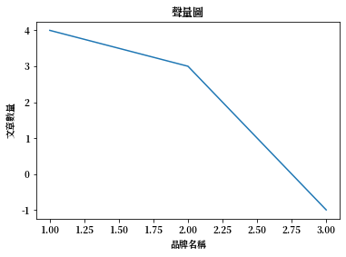
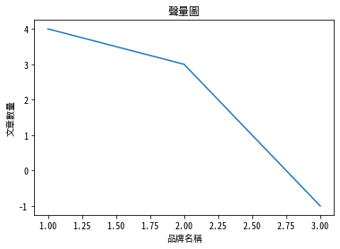

# Matplotlib 顯示中文

Ref: [Text with non-latin glyphs](https://matplotlib.org/3.1.0/tutorials/text/text_props.html#text-with-non-latin-glyphs)

下載思源體（下面兩種任選一種皆可）

1. [思源黑體](https://noto-website-2.storage.googleapis.com/pkgs/NotoSansCJKtc-hinted.zip)
2. [思源宋體](https://noto-website-2.storage.googleapis.com/pkgs/NotoSerifCJKtc-hinted.zip)

Then,

- [Windows](#windows)
- [Mac](#mac)
- [Ubuntu](#ubuntu)

## Windows

### 查看matplotlib套件安裝位置

```python
import matplotlib
print(matplotlib.__file__)
```
Output:

```
C:\Users\USER\Miniconda3\envs\tensorflow\lib\site-packages\matplotlib\__init__.py
```

可以得知，`matplotlib`的安裝位置在`C:\Users\USER\Miniconda3\envs\tensorflow\lib\site-packages\matplotlib`。

* Note:

    ```
    每個人的安裝位置會因電腦配置而有所不同。
    ```

### 安裝步驟

1. 解開剛剛下載的壓縮檔
2. 任選一個`.otf`檔案，複製到`C:\Users\USER\Miniconda3\envs\tensorflow\lib\site-packages\matplotlib\mpl-data\fonts\ttf\`資料夾內
3. 刪除這個資料夾內的所有檔案：`C:\Users\USER\\.matplotlib\`
4. 如果使用的是`思源黑體`，請將底下的`fontType =' '`變更為`fontType ='Noto Sans CJK TC'`
5. 如果使用的是`思源宋體`，請將底下的`fontType =' '`變更為`fontType ='Noto Serif CJK TC'`

### Configuration

```python
import matplotlib.pyplot as plt

fontType = ''

plt.rcParams['font.sans-serif'] = [fontType]
plt.rcParams['axes.unicode_minus'] = False

%matplotlib inline
```

### Plot the result

```python
plt.figure()
plt.plot((1, 2, 3),(4, 3, -1))
plt.title("聲量圖")
plt.ylabel("文章數量")
plt.xlabel("品牌名稱")
plt.show()
```




## Mac

### 查看matplotlib安裝了哪些字型

```python
# 查看安裝了哪些字型
# windows請忽略這段
# unix系統可以使用下command確認是否安裝成功
!fc-list :lang=zh family
```

### 重新加載字體

```python
# 重新加載字體
from matplotlib.font_manager import _rebuild
_rebuild()
```

```python
import matplotlib
import matplotlib.pyplot as plt

# 使用剛剛下載的思源體字型
plt.rcParams['font.sans-serif'] = ['Noto Sans Mono CJK TC', 'sans-serif']
plt.rcParams['axes.unicode_minus'] = False

%matplotlib inline
```

### Plot the result

```python
plt.figure()
plt.plot((1, 2, 3),(4, 3, -1))
plt.title("聲量圖")
plt.ylabel("文章數量")
plt.xlabel("品牌名稱")
plt.show()
```




## Ubuntu

### 查看matplotlib安裝了哪些字型

```python
# 查看安裝了哪些字型
# windows請忽略這段
# unix系統可以使用下command確認是否安裝成功
!fc-list :lang=zh family
```

```python
import matplotlib
import matplotlib.pyplot as plt

# 使用剛剛下載的思源體字型
plt.rcParams['font.sans-serif'] = ['Noto Sans Mono CJK TC', 'sans-serif']
plt.rcParams['axes.unicode_minus'] = False

%matplotlib inline
```

### Plot the result

```python
plt.figure()
plt.plot((1, 2, 3),(4, 3, -1))
plt.title("聲量圖")
plt.ylabel("文章數量")
plt.xlabel("品牌名稱")
plt.show()
```


