# Distributed Training (分散式訓練) - 介紹

分散式訓練是指將訓練模型的工作負載分散到多台機器的多個 GPU 上進行。

分散式訓練 - 平行處理的方式主要分為兩種類型:

- [資料平行處理 (Data Parallel)](#資料平行處理-data-parallel)
- [模型平行處理 (Model Parallel)](#模型平行處理-model-parallel)

當然也可以結合兩種方法: [資料平行處理 + 模型平行處理](#data_plus_model_parallel)

分散式訓練 - 系統架構(調度的方式)主要分為兩種類型:

- [Parameter Server](#parameter-server)
- [Ring-All-Reduce](#ring-all-reduce)

## 資料平行處理 (Data Parallel)

> 資料平行處理是實作兩種分散式訓練方法中最簡單的方式，且足以用於大部分的使用案例。

當`數據量非常大，並且模型能夠放置在單個 GPU 上時`，就可以採用資料平行化的方式來進行。

資料平行處理作法是，在不同的 GPU 上都複製一份模型，然後依照一些規則將資料分配到不同的 GPU 上進行計算，各自進行訓練後，將所有 GPU 計算的結果合併，再進行參數更新，從而達到加速模型訓練的目的。如下圖所示:

<p align="center">
    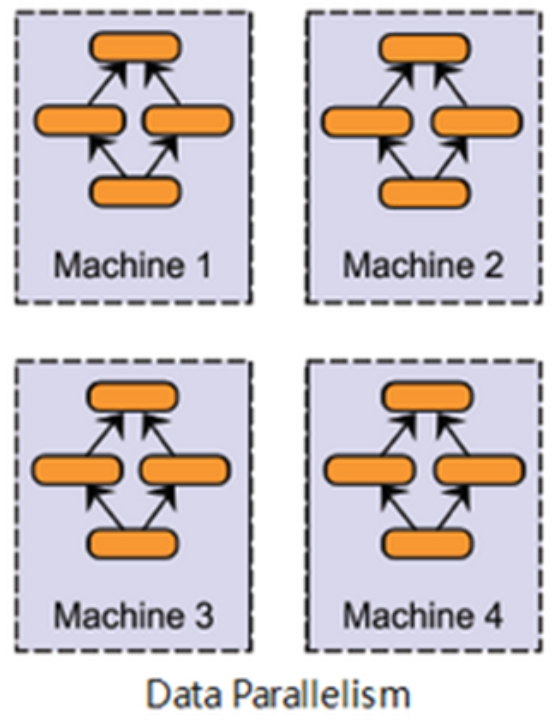
    
</p>

##### Example: Azure 資料平行處理原則

以下說明 Azure 中的 Data Parallel，如下圖所示:

<p align="center">
    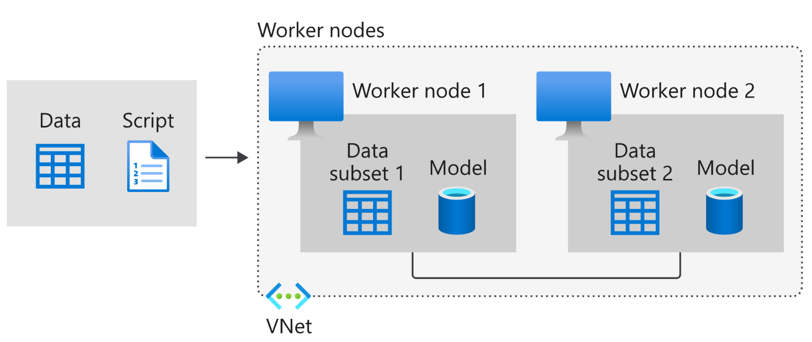
    
</p>

如上，資料會分割成分割區，而分割區數目等於計算叢集中可用節點的總數。 模型會在其中每個背景工作節點中複製，而且每個背景工作會在自己的資料子集上運作。 請記住，每個節點都必須有容量來支援要訓練的模型，也就是模型必須完全符合每個節點。

每個節點都會個別計算其訓練範例的預測和已標記輸出之間的誤差。 接著，每個節點都會根據誤差來更新其模型，而且必須將其所有變更傳達給其他節點，以更新其對應的模型。 這表示，背景工作節點必須在批次計算結束時同步模型參數或梯度，以確保其訓練一致的模型。

### 資料平行處理: 參數更新的方式

由於資料平行會涉及到把不同 GPU 的計算結果進行合併然後再進行參數更新，根據跟新方式不同，可以分為:

`在資料並行中，每個GPU只計算一個batch中的一部分資料`

- 同步更新 (synchronous):

    訓練時會等待所有 GPU 都計算完畢後，再統一更新模型的參數，因此訓練速度上會比使用異步的方式來得慢。但因為在更新參數時會合併其他計算結果，相當於增加了 batch size 的大小，對於訓練結果有一定的提升。

- 非同步、異步更新 (asynchronous):

    每個 GPU 在獨立計算完之後，不須等待其他 GPU，可以各自立即更新參數。能夠提升訓練速度，但可能會產生 `Slow and Stale Gradients (梯度失效、梯度過期)` 問題，收斂過程較不穩定，訓練結果會比使用同步的方式差。

    - 梯度失效:每一個 GPU 完成訓練之後，都會馬上去更新參數，這會造成其他 GPU 現在的模型引數和這一輪訓練前採用的模型引數可能不一致，從而導致此時的梯度過期。

    > 非同步更新雖然快，但是由於梯度失效問題，模型往往會陷入到次優解中。

<p align="center">
    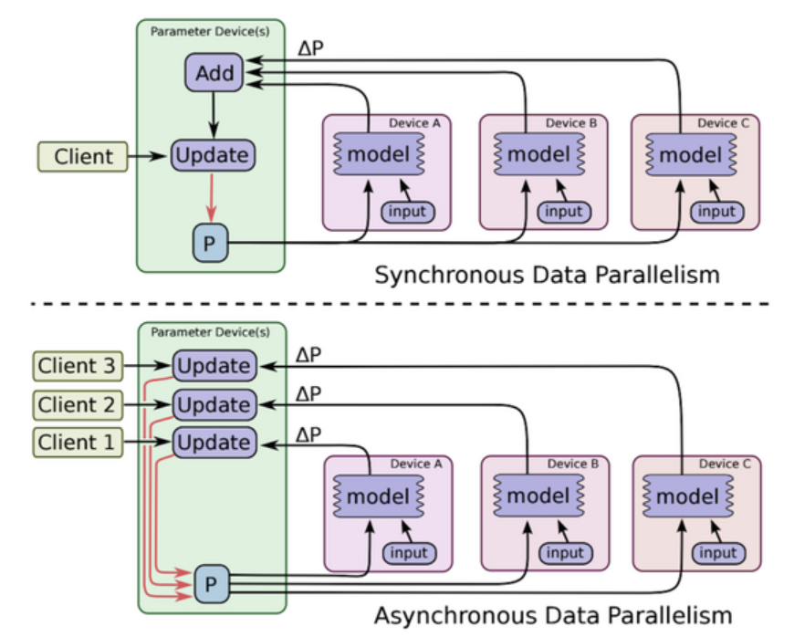
    
</p>

## 模型平行處理 (Model Parallel)

> 各個 GPU 只加載了模型的一部分網路結構，存在一定的依賴關係，
> 造成了規模的伸縮性比較差，不能隨意的增減 GPU 的數量，因此在實際中運用的並不多。

當`模型架構太大以至於在一個 GPU 放不下時`，可以採用`模型平行化 (model parallel)`的方式來進行。

```
model parallel，也叫做 tensor parallel
```

模型平行處理的作法是，將整個神經網路模型拆解並分配到不同的 GPU 上，且不同的 GPU 負責模型中不同的部份。由於模型層與層之間通常有依賴性，也就是指在進行前向傳播、反向傳播時，前面及後面的層會作為彼此的輸入和輸出，因此這種序列的邏輯對加速造成了一定的限制。如下:

<p align="center">
    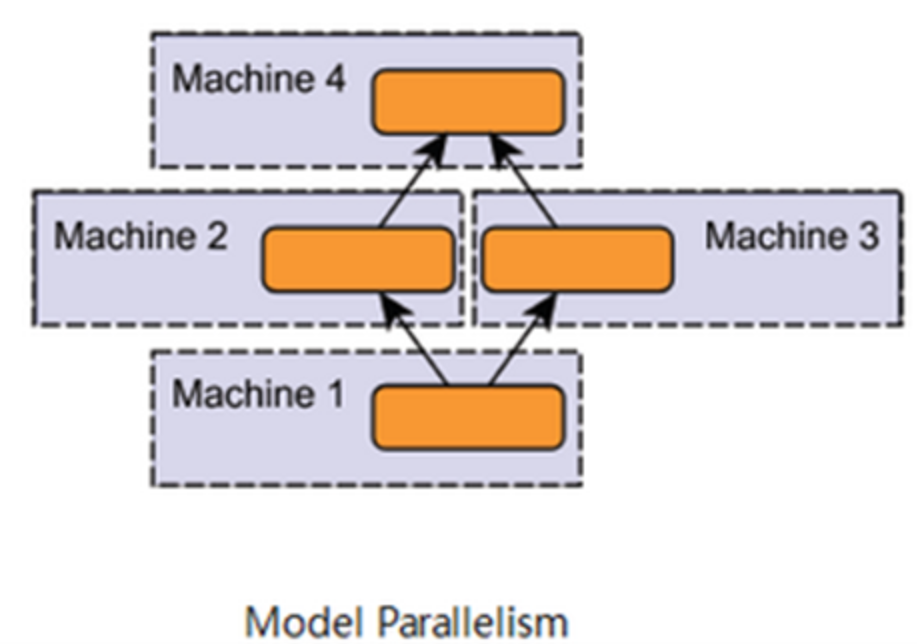
    
</p>

此方法通常是在模型非常大時，，如: `GPT-3`，單個 GPU 的記憶體已經完全裝部下整個網路時才會使用。但相比起來，我們可以此方式把一個超大模型訓練起來，不然對於一個單GPU的話，超大模型是完全沒辦法 work 的。

因此若非使用較大的模型較不建議採用模型平行處理。若想提升訓練速度，可以選擇較容易進行平行運算的 model，如: `Inception`。

##### Example: Azure 模型平行處理原則

以下說明 Azure 中的 Model Parallel，如下:

在模型平行處理中 (也稱為網路平行處理)，模型會分割成不同部分，並且可以在不同的節點中同時執行，而且每一個部分都會在相同的資料上執行。 此方法的可擴縮性取決於演算法的工作平行處理程度，而且比資料平行處理的實作更複雜。

在模型平行處理中，背景工作節點只需要同步共用參數，通常是針對每個向前或向後傳播步驟進行一次同步。 此外，較大的模型也不會有問題，因為每個節點都是在相同訓練資料的模型子區段上運作。

<apan id="data_plus_model_parallel">

## 兩者結合: 資料平行處理 + 模型平行處理

當然也可以兩種方法: `資料平行處理 + 模型平行處理`方式，如下圖所示:

<p align="center">
    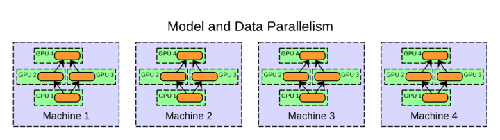
    
</p>


作法是:

- `模型平行處理`: 將模型拆解並分配到單個機器中不同的 GPU 上，
- `資料平行處理`: 同時將模型複製到其他機器中的每個 GPU 中，而資料數據也會依照一些規則分配到不同的 GPU 上


## 分散式訓練系統架構

上面介紹的是平行處理的方式。那這些平行化運算的方式是如何進行加速的呢？各個設備又是如何將計算結果相互交換的呢？分散式訓練之所以能達到這兩件事是藉由系統架構的設計來實現。現在我們來看實際在分散式訓練中是怎麼進行訓練的調度的呢？

系統架構(調度的方式)主要分為兩種類型:

- [Parameter Server](#parameter-server)
- [Ring-All-Reduce](#ring-all-reduce)

### Parameter Server

>是一種參數集中調度的架構

資料平行訓練產生局部梯度，再匯總梯度後更新模型參數權重。如下圖所示:

<p align="center">
    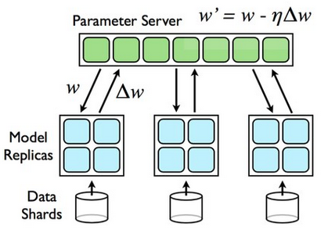
    
</p>

> 注意: 此方法為`同步更新 (synchronous)`

#### Parameter Server 整體架構

Parameter Server 架構主要分為兩大部份，如下圖:

<p align="center">
    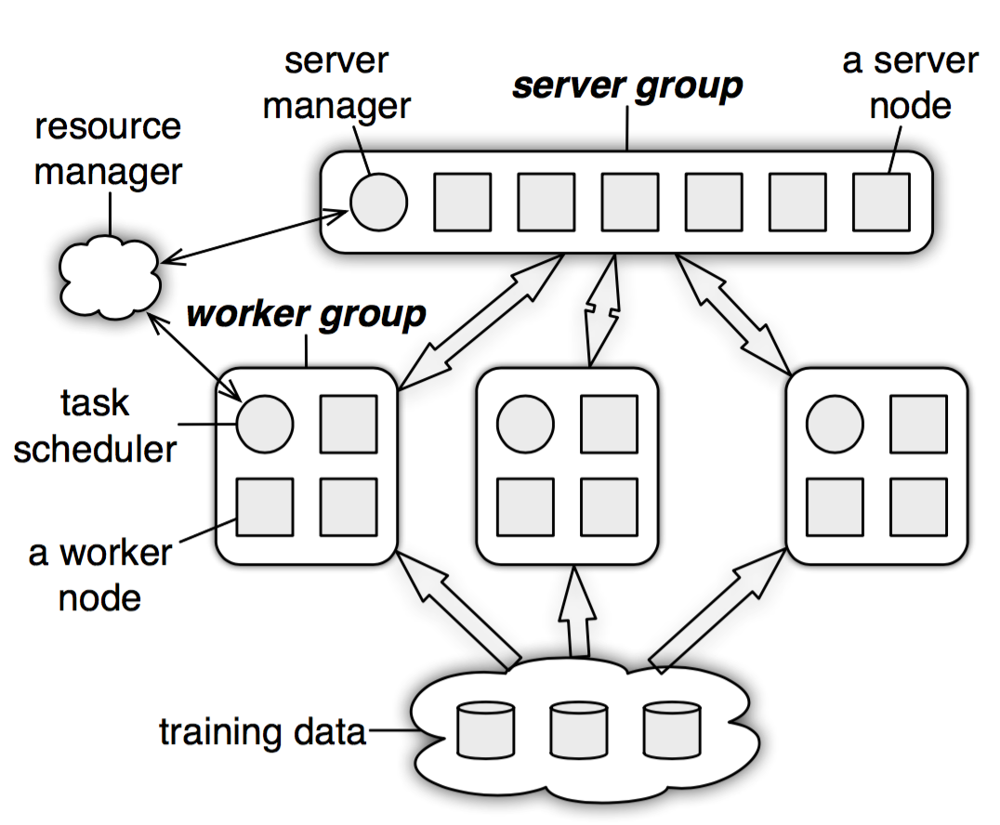
    
</p>

- 一個 Parameter Server group:

    > 負責初始化及維護一個完整的全域共享參數(Global Parameters)，將當前的值發送給每個 worker 進行平行訓練。並且接收 worker 傳回的局部梯度，計算全部完整梯度，並更新模型參數。

    由 sever manager 和多個 sever node 組成，其中:
    - sever manager: 負責分配資源並維護各個 sever node 的狀態

        ```
        原數據(metadata)的一致性
        ```

    - sever node: 則是負責維護被分配的一部分參數。

        ```
        每個 server node 實際上都只負責分到的部分參數
        ```

- 多個 worker group:

    > 用於維護從 dataset 分配到的 data 及對應的 sever node 所分配到的部分參數。訊練後獲得的新的梯度會發送到 server group 並更新參數。

    每個 worker group 由以下組成:
    - task scheduler: 負責分配各個 worker node 的任務並進行監控
    - 多個 worker node: 負責進行訓練和更新各自分配到的參數

        ```
        每個 worker 只分到部分數據和處理任務
        ```

    且每個 worker node 只與對應的 sever node 進行通訊，worker group 和 worker group 或 worker group 內部的每個 worker node 之間都不會互相交流。

#### Parameter Server 工作流程 - 同步更新

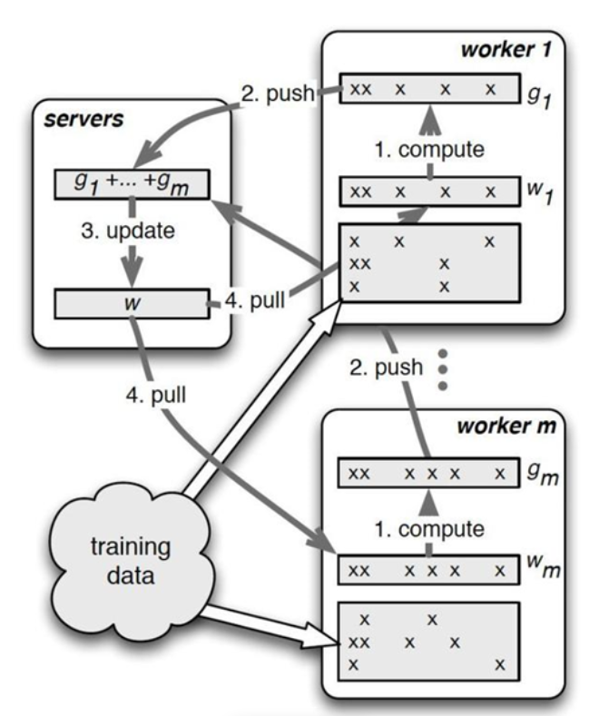


同步更新流程如上圖所示:

1. 每個 worker group 會各自進行訓練、計算梯度、更新分配到的部分參數，再將結果傳送給 server node。
2. 接著 server node 把收到的參數彙總並進行 global 更新 (ex: 平均參數)，再傳回給 worker node。

由於 server node 需要跟所有對應的 worker node 進行溝通，容易導致 sever node 的計算過重以及網路阻塞的狀況，從而使得訓練速度下降。

##### Example

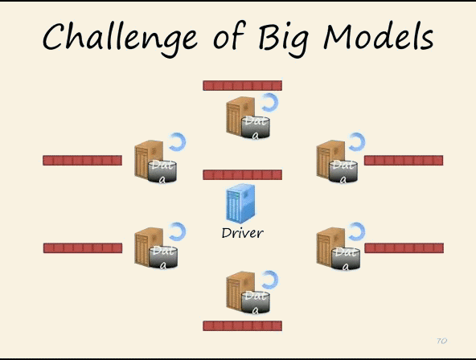


上圖中，每個子節點都只維護自己分配到的參數（圖中的黑色），自己部分更新之後，將計算結果（例如：梯度）傳回到主節點，進行全域的更新（比如平均操作之類的），主節點再向子節點傳送新的參數。

#### Parameter Server 工作流程 - 異步更新

參數更新可以在 Worker 之間以`非同步(Asynchronous)`完成，因此 Worker 可以在整個訓練過程中彼此獨立運行，並在大規模訓練中獲得更好的可擴展性，如下圖所示:

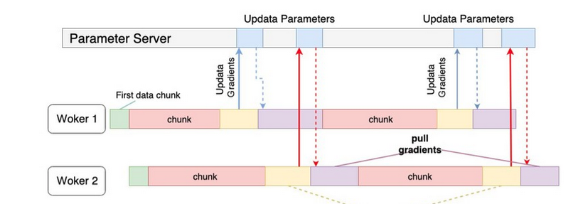


##### Example


比較同步更新如下所示:


#### Parameter Server - 瓶頸/缺點

雖然 Parameter Server 的架構容易管理，但隨著 Worker (GPU) 數目增加，maseter (Reducer) 的負擔也會越來越大，如下圖所示:

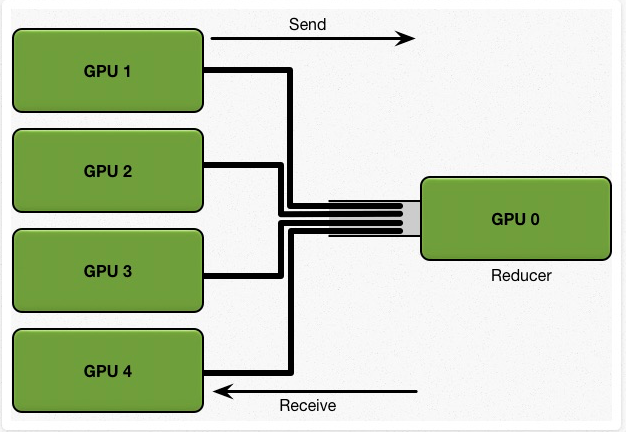


假設有 5 塊 GPU，每一塊 GPU 擁有完整的模型，總共的訓練 dataset 大小為 K。

考慮一個簡單的同步更新策略。首先，每張 GPU 擁有同樣的初始參數，我們將大小為 K 的訓練資料分為 N 塊，也就是 5塊，分給每張GPU。每個 GPU 基於自己那一部分的資料，計算得到 local gradients，然後 N-1塊（4塊）GPU 將計算所得的 local gradients 發送給 GPU 0，讓 GPU 0 對所有的 local gradients 進行 reduce(匯聚操作) 得到全域的梯度，然後再將該全域梯度返回給每塊 GPU 來更新每個GPU上的模型參數。

那麼我們可以計算下整個通信過程的 communication cost:

假設每張 GPU 需要發送給 GPU 0 的通信資料大小是 1GB，我們的 network bandwidth 是 1GB/s，那麼我們需要 4 秒才可以將數據全部發送到 GPU 0 上，然後計算出 global 的平均梯度。我們可以看到其通信成本是 C * N，由於受 GPU 0 的network bandwidth的影響，`通信成本隨著設備數的增加，而線性增長`。

> Parameter Server 隨著 worker 數量的增加，其 speedup ratio 會急速下降。

### Ring-All-Reduce

> 與 Parameter Serve 相反，是去中心化調度的架構

Ring-All-Reduce 架構是將所有 GPU 呈現環狀的形式，且每個 GPU 中的數據會分為 N 份，GPU 之間會根據環狀的方式來傳送數據，如下圖所示:

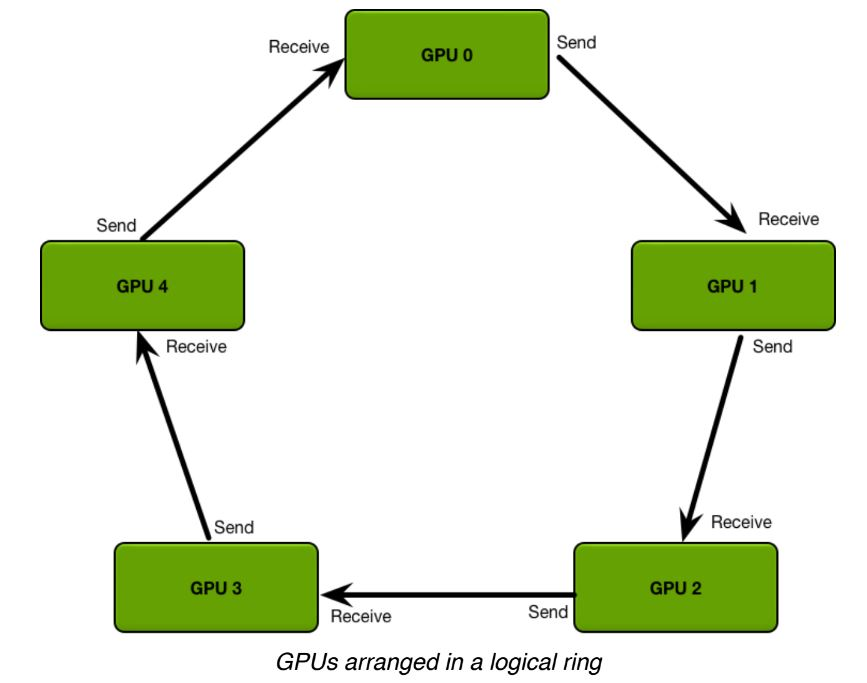


這樣的架構所產生的通訊量與設備的多寡無關，因此能夠大幅地減少通訊的開銷、更好地平衡設備間通訊的使用程度。

而且，在訓練過程中，可以利用 `Backpropagation 的特性 (後面層的梯度會先於前面層計算)`，在計算前面層梯度的同時，進行後面層梯度的傳送，以提升訓練效率。

### Ring-All-Reduce 工作流程

流程如下所示:

1. 首先第 k 個 GPU 把第 k 份的數據傳給下一個 GPU

    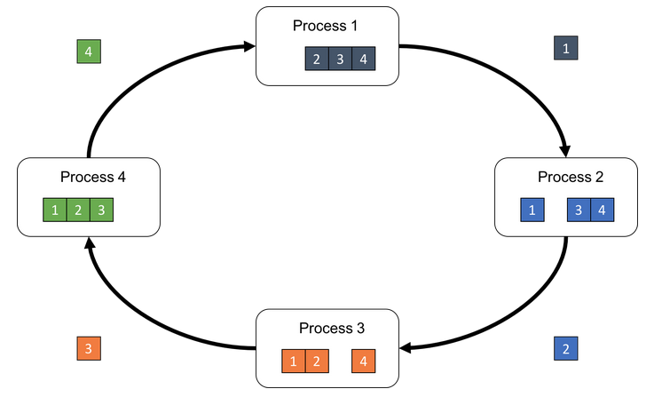
    

2. 接著下一個 GPU 會將收到的第 k 份數據與自己的第 k 份數據進行加總整合後，再傳送給下一個 GPU。

    
    

3. 經過 N 次的迭代循環後，第 k-1 個 GPU 會收到所有第 k 份的最終整合數據，再以這份數據來更新各自的參數。

    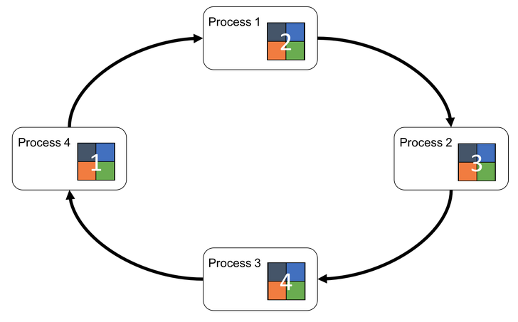
    


動畫如下:

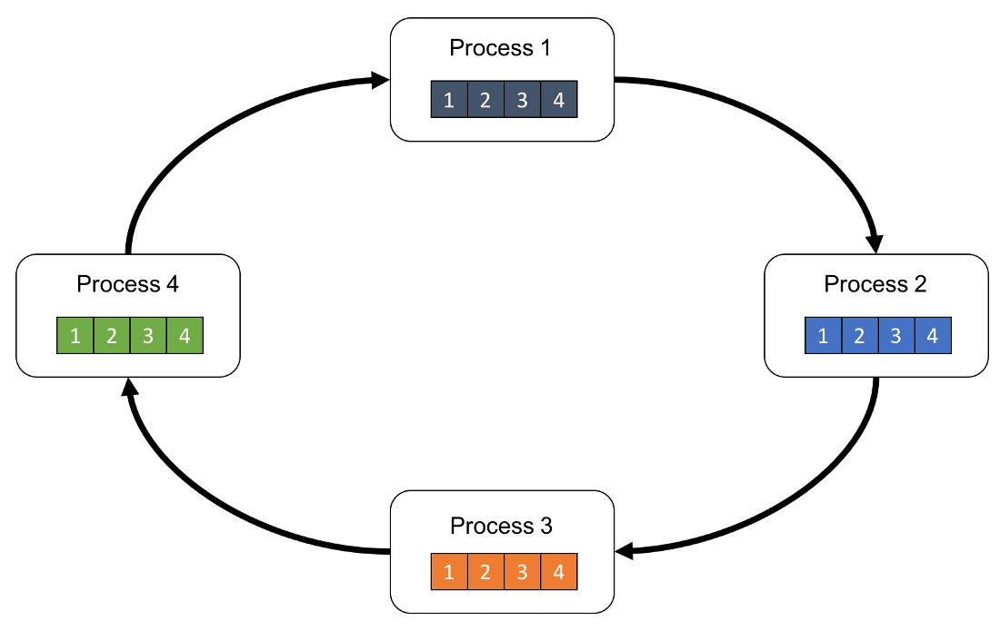


## Reference

- [什麼是分散式訓練? - Azure](https://learn.microsoft.com/zh-tw/azure/machine-learning/concept-distributed-training)
- [Pytorch 分散式訓練 DistributedDataParallel — 概念篇 | by 李謦伊](https://medium.com/ching-i/pytorch-%E5%88%86%E6%95%A3%E5%BC%8F%E8%A8%93%E7%B7%B4-distributeddataparallel-%E6%A6%82%E5%BF%B5%E7%AF%87-8378e0ead77)
- [深度學習中的分散式訓練_OPPO數智技術 - MdEditor](https://www.gushiciku.cn/pl/gXXt/zh-tw)
- [Kubeflow 進行分散式深度學習訓練之作業排程瓶頸 - Speaker Deck](https://speakerdeck.com/yylin1/kubeflow-jin-xing-fen-san-shi-shen-du-xue-xi-xun-lian-zhi-zuo-ye-pai-cheng-ping-jing)
- [深度学习加速：算法、编译器、体系结构与硬件设计](https://zhuanlan.zhihu.com/p/101544149)
- [Parameter Server 學習筆記 - Yi Yang's Blog](http://www.yylin.io/2019/01/09/parameter-server-concept/)
- [Technologies behind Distributed Deep Learning: AllReduce](https://tech.preferred.jp/en/blog/technologies-behind-distributed-deep-learning-allreduce/)
- [ring allreduce和tree allreduce的具体区别是什么？ - 知呼](https://www.zhihu.com/question/57799212/answer/292494636?utm_source=ZHShareTargetIDMore&utm_medium=social&utm_oi=37729630945280)
- [Ring AllReduce简介](https://www.modb.pro/db/434006)
- [浅谈 Tensorflow 分布式架构：ring all-reduce 算法](https://www.infoq.cn/article/3cuypbqlprdjochsyb2j)
