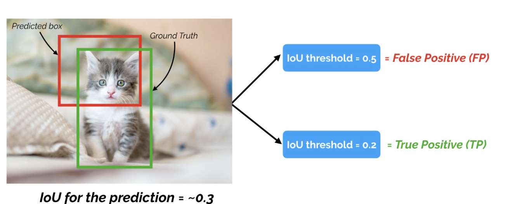
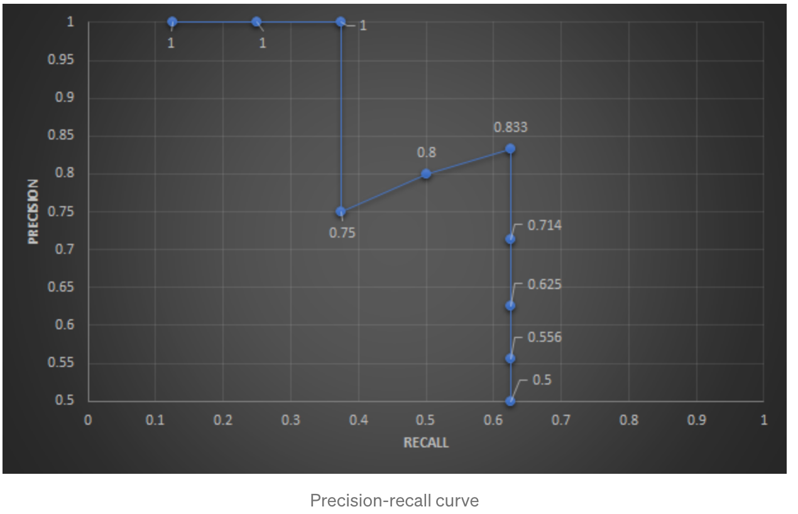
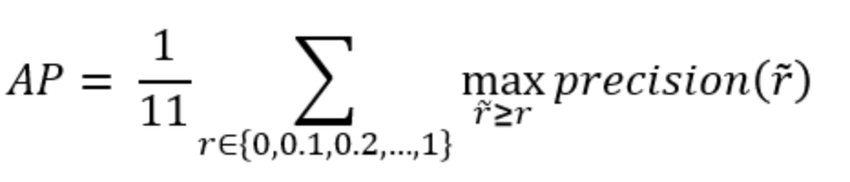
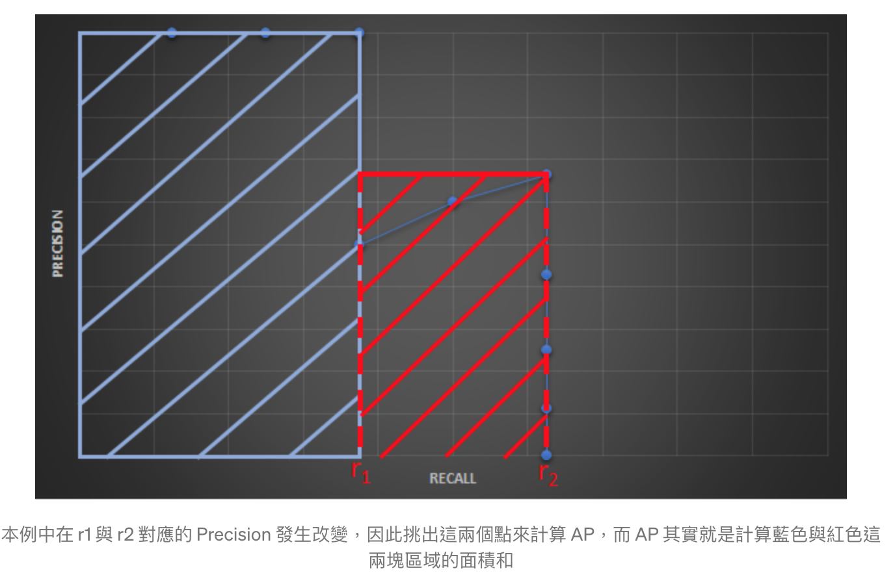

# 目標檢測評估指標 (Object Detection Metrics)

> 2024/6/4 updated!

Object Detection 需要執行兩個任務:

1. decide whether an object exists in the scene: `classification`
2. determine the position, the orientation and the shape of the object: `localization`

在現實場景中，一個場景會包含很多物件類別（如: 車輛、行人、騎自行車的人、交通標誌），這導致有必要為每個檢測到的對象分配一個置信度 (confidence) 分數，通常在 0.0 ~ 1.0 之間。

基於這個分數，可以在不同的 confidence levels 上評估檢測算法，這意味著改變`閾值 (threshold)` 會造成不同結果。為了解決這些問題，`Average Precision (AP)` 指標被作為對象檢測的合適指標。

在介紹 AP 前讓我們先認識下會用到的其他評估術語。

## Confusion Matrix (TP、FP、FN、TN)


舉例，判斷是否為狗的模型中:

- `True positive (TP)`: 是狗且被模型判斷為狗的數量
- `False positive (FP)`: 不是狗但被模型判斷為狗的數量
- `False negative (FN)`: 是狗但被模型判斷為不是狗的數量
- `True negative (TN)`: 不是狗且被模型判斷為不是狗的數量

物件偵測模型:

> 後面會再詳細解說。

- `True positive (TP)`: 成功檢測到某個 ground truth boundind box 的預測框的數量
- `False positive (FP)`: 沒能匹配到任一個 ground truth bounding box 的預測框的數量
- `False negative (FN)`: 未被檢測到的 ground truth bounding box 的數量
- `True negative (TN)`: 忽略不計

## Precision and Recall

1. What is the probability that an object found by the algorithm actually corresponds to a real object?

   -> `Precision` or `Positive Predictive Value" (PPV)`

2. What is the probability for a real object to be found by the detector?

   -> `Recall` or `True Positive Rate" (TPR)` or `sensitivity`.

理想情況是 Precision 和 Recall 都是 1.0，
但通常會是相反的，提高 Recall 就會降低 Precision，反之亦然。

### Precision (準確率)

當模型預測為特定類別的目標物，有多少是正確的。 (`針對預測結果`)

$$ Precision = \frac{TP}{(TP + FP)} $$

### Recall (召回率)

又稱 Sensitivity (靈敏度)。實際為目標物也確實被預測為目標物的比例。(`針對原來的樣本`)

$$ Recall = \frac{TP}{(TP + FN)} $$

##### Example 1:

假設有一個 detector, TP=80, FP=2, FN=6

```
P = 80 / (80 + 2) = 0.9756
R = 80 / (80 + 6) = 0.9302
```

當我們`降低 classification threshold` 時，confidence 分數較低的物件將會被檢測到，則 `FN 下降，FP 上升`，導致 `Recall 上升，Precision 下降`，如: TP=80, FP=6, FN=2

```
P = 80 / (80 + 6) = 0.9302
R = 80 / (80 + 2) = 0.9756
```

##### Example 2:


如上圖所示，圖片裡有4台汽車，但模型偵測出5台汽車

```
TP = 4
FP = 1
FN = 0

Precision = TP / (TP + FP) = 4 / 5
Recall = TP / (TP + FN) = 4 / 4 = 1
```

## F1-score (F1-Mesure)

> 他是`F-score`的一個特例，當`beta=1`時就是`F1-score`。

`F1-score 是 recall 和 precision 的 加權調和平均數`，顧名思義就是為了調和 recall 和 precision 之間增減反向的矛盾，對 recall 和 precision 進行加權調和，公式如下:

```
F1-score = 2 * ((Precision * Recall) / (Precision + Recall))
```

$$
\begin{aligned}
F1-score
& = 2 * \frac{Precision * Recall}{Precision + Recall} \\
& = \frac{2TP}{2TP + FN + FP}
\end{aligned}
$$

`F1-score`最理想的數值是`趨近於1`，就是讓 precision 和 recall 都有很高的值。假設 Precision 與 Recall 皆為1，則`F1-score = 1 (100%)`，代表該演算法有著最佳的精確度

## Intersection over Union (IoU)

`IoU` 簡單來說就就是評估預測的 `pred bounding box` 與 `ground truth box` 有多重疊(多像)，如下所示:


### IoU and Precision and Recall

在 Onject Detection 的任務中，*我們可以透過 IoU 來計算 Precision 與 Recall，根據 IoU Threshold 判斷*，一般情況下，`如果 bounding box 被預測為確實有目標物存在，且 IoU 大於所設之 threshold，我們就認定此 boundind box 為 True Positive (TP)，反之為 Flase Positive (FP)。`

- True Positive (TP): IOU >= threshold (閾值)
- False Positive (FP): IOU < threshold (閾值)
- False Negative (FN): 未被檢測的 Ground Truth
- True Negative (TN): 忽略不計

> ###### NOTE: IoU Threshold 的選擇很重要！！！通常是用 0.5

#### Examples

假設 `IoU Threshold: 0.5`

1. Object IoU 0.7 -> TP
2. Object IoU 0.3 -> FP


現在針對 `IoU = 0.3` 這個預測框來看

1. 假設 IoU Threshold 0.5: 那麼這預測框就會被判定為 FP
2. 假設 IoU Threshold 0.2: 那麼這預測框就會被判定為 TP




所以 IoU Threshold 的選擇很重要！

## Precision-Recall Curve

PR 曲線就是以 precision 和 recall 作為 x-y 軸座標的曲線。根據選取不同的 threshold 可以畫出不同的 PR 曲線。

As mentioned previously, there is an inverse relationship between precision and recall, which is dependent on the threshold we choose for object detection. Let us take a look at the following figure, which shows the precision-recall curves of various object detection algorithms (each color represents a different algorithm):

<p align="center">
    
    <em>Precision-Recall curves for 5 detectors</em>
</p>
<p align="center">
    
    <em>Precision-Recall curves for 5 detectors</em>
</p>

這些曲線是通過將 threshold 從 0.0 到 1.0 並計算每個 precision 和 recall 而生成的。基於此指標，可以發現藍色實線擁有最佳性能，因為 precision 隨著 recall 的增加而下降最少。
理想情況下，precision 將保持在 1.0，直到 recall 到達 1.0 。因此，查看這些曲線的另一種方法是根據`曲線下的面積(area under curve, AUC)`比較檢測器，因此，`PR 曲線下的面積越大，此檢測器的性能越高`。

Based on the precision-recall curve, engineers can make an informed decision on the detector threshold setting they want to choose by considering the demands of their application in terms of precision and recall.

## Average Precision (AP)

> AP 就是 計算 PR 曲線下面積的近似值，是一個 0~1 之間的數值。

我們先來看看 Average Precision 的定義：

The idea of the `average precision (AP)` metric is to `compact the information within the precision-recall curve into a single number`, which can be used to easily compare algorithms with each other. This goal is achieved by summing the precision values for different (=11) equally spaced recall values:

$$ AP=\frac{1}{11} \sum_{Recall_i} Precision(Recall_i)$$


Note that in practice, varying the threshold level in equally spaced increments does not correspond to equally spaced increases in recall. The AP score for an algorithm varies between 0.0 and 1.0 with the latter being a perfect result.

所謂的 `Average Precision (AP) 就是計算 Precision-Recall 曲線下的面積`。且由於 Precision 與 Recall 都是介於 0~1 之間的數值，因此 `AP 也是介於 0~1 之間的數值`。

### Example of AP

接下來讓我看一下例子 [2&3]:

假設偵測目標為車子且總共有8台，Ground Truth 與模型給出的預測如下所示:


1. 將結果`按照 Confidence 大小降序排序`，且 `IoU Threshold 為 0.5`，如下:

    
    

2. `針對每個預測，決定其是 TP or FP，並且計算 Precision 和 Recall`，如下:

    ```
    Rank 1:
      Precision = TP / (TP+FP) = 1/1 = 1
      Recall = TP / total P = 1/8 = 0.125
    Rank 2:
      Precision = 2/2 = 1
      Recall = 2/8 = 0.25
    Rank 3:
      Precision = 3/3 = 1
      Recall = 3/8 = 0.375
    Rank 4:
      Precision = 3/4 = 0.75
      Recall = 3/8 = 0.375
    Rank 5:
      Precision = 4/5 = 0.8
      Recall = 4/8 = 0.5
    Rank 6:
      Precision = 5/6 = 0.833
      Recall = 5/8 = 0.625
    Rank 7:
      Precision = 5/7 = 0.714
      Recall = 5/8 = 0.625
    Rank 8:
     Precision = 5/8 = 0.625
     Recall = 5/8 = 0.625
    Rank 9:
      Precision = 5/9 = 0.556
      Recall = 5/8 = 0.625
    Rank 10:
      Precision = 5/10 = 0.5
      Recall = 5/8 = 0.625
    ```

    畫出 `Precision-Recall` curve, 如下:

    
    

    可以發現到:
    - Recall 會隨著計算的 case 越多呈現越來越大的趨勢
    - Precision 則不一定，會根據 TP or FP 而一直跳動

3. `拉平曲線 (smooth the curve)`

    
    

    Graphically, at each recall level, we replace each precision value with the maximum precision value to the right of that recall level.

    
    

### Interpolated AP (PASCAL VOC Challenge before 2010)

PASCAL VOC is a popular dataset for object detection. For the PASCAL VOC challenge, a prediction is positive if IoU ≥ 0.5. Also, if multiple detections of the same object are detected, it counts the first one as a positive while the rest as negatives.

Pascal VOC2010之前將 Recall 分成 11 個點，分別為 `{0, 0.1, , …, 0.9, 1.0}`，並找出這幾個點的最大 Precision 作平均計算。




```
AP = (1+1+1+1+0.833+0.833+0.833+0+0+0+0) / 11 = 0.591
```

### AUC (Area under curve ) AP (PASCAL VOC Challenge after 2010)

Instead of sampling 11 points, we sample p(rᵢ) whenever it drops and computes AP as the sum of the rectangular blocks.


This definition is called the `Area Under Curve (AUC)`.




```
AP = 1*0.375 + 0.833*(0.625-0.375) = 0.583
```

As shown below, as the interpolated points do not cover where the precision drops, both methods will diverge.


## Mean Average Precision (mAP)

`Mean Average Precision (mAP)`有兩種:

- 考慮各種不同 IoU 值
- 除了 IoU 值還考慮各種對象類別

### Based on only IoU

因為改變 IoU 閾值會影響無論是 Precision 或是 Recall，此時 mAP 就是計算個 IoU 閾值下的 AP 分數，然後根據這些值計算平均值。如下圖所示:


Precision-Recall curves for varying IoU thresholds


但有些 dataset的 mAP 跟 AP 是一樣的，像 COCO dataset，所以須去了解各自 dataset 的 AP 與 mAP 定義。

*AP is averaged over all categories. Traditionally, this is called “mean average precision” (mAP). We make no distinction between AP and mAP (and likewise AR and mAR) and assume the difference is clear from context. [COCO Evaluation](https://cocodataset.org/#detection-eval)*

```
AP50: IoU threshold 0.5
AP75: IoU threshold 0.75
```

## Reference

1. [mAP (mean Average Precision) might confuse you!](https://towardsdatascience.com/map-mean-average-precision-might-confuse-you-5956f1bfa9e2)
2. [mean Average Precision (mAP) — 評估物體偵測模型好壞的指標](https://medium.com/curiosity-and-exploration/mean-average-precision-map-%E8%A9%95%E4%BC%B0%E7%89%A9%E9%AB%94%E5%81%B5%E6%B8%AC%E6%A8%A1%E5%9E%8B%E5%A5%BD%E5%A3%9E%E7%9A%84%E6%8C%87%E6%A8%99-70a2d2872eb0)
3. [Tommy Huang — 深度學習系列: 什麼是AP/mAP?](https://chih-sheng-huang821.medium.com/%E6%B7%B1%E5%BA%A6%E5%AD%B8%E7%BF%92%E7%B3%BB%E5%88%97-%E4%BB%80%E9%BA%BC%E6%98%AFap-map-aaf089920848)
4. [Jonathan Hui - mAP (mean Average Precision) for Object Detection](https://jonathan-hui.medium.com/map-mean-average-precision-for-object-detection-45c121a31173)
