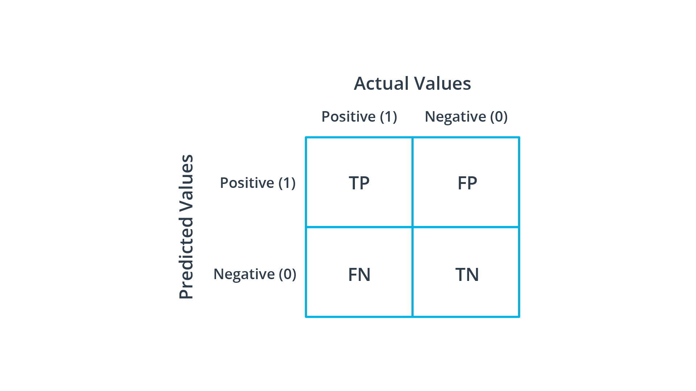

# Segmentation Metrics

影像分割是對影像中的每個 Pixel 做分類，可分為:

- 語意分割 (Semantic Segmentation): 注重類別之間的區分，而不是同類別不同個體
- 實例分割 (Instance Segmentation): 同時注重類別及同類別中不同個體
- 全景分割 (Panoptic Segmentation): 語意分割+實例分割。

如下所示:


## Confuion Matrix (混淆矩陣)

混淆矩陣 (Confusion Matrix) 是由 TP、FP、FN、TN 四種狀況所組合而成，可以很清楚地反映各類別之間被劃分的關係，
我們藉由此來延伸出 segmentation 的評估指標。如下:




在判斷是否為狗的模型中:

- `True positive (TP)`: 是狗且被模型判斷為狗的數量
- `False positive (FP)`: 不是狗但被模型判斷為狗的數量
- `False negative (FN)`: 是狗但被模型判斷為不是狗的數量
- `True negative (TN)`: 不是狗且被模型判斷為不是狗的數量

在影像分割模型中:

假設圖像資料為 9 個 pixel，如下圖:


- `True positive (TP)`: 預設的 pixel 與實際皆為真的數量。
- `False positive (FP)`: 預測 pixel 為真但實際為假的數量。
- `False negative (FN)`: 實際 pixel 為真但預設為假的數量。
- `True negative (TN)`: 預設的 pixel 與實際皆為假的數量。

> 此真假為 segmentation 時此 pixel 是否為我們想要的 pixel
> 若是則為真: 1
> 若不是則為假: 0

如範例:


讓我們來看一下實際圖片在影像分割任務上的 TP、FP、FN、TN，如下所示:


- TP: 中間黃色區塊
- FP: 左邊藍色斜線區
- FN: 右邊紅色斜線區
- TN: 白色斜線區 (背景)

## Accuracy, Precision, and Recall

在影像分割中:

- Accuracy: Pixel Accuracy
- Precision: Class Pixel Accuracy

### Pixel Accuracy (PA)

在所有類別預測正確的 Pixel 佔總 pixel 的比例。

```
PA = TP + TN / (TP + TN + FP + FN)
```

### Class Pixel Accuracy (CPA)

在對所有預測為類別 i 的 Pixel 中 ，實際屬於類別 i 的 Pixel 的比例。

```
Precision = TP_{i} / (TP_{i} + FP_{i})
```

#### Example:

- Class 1: P1 = TP1 / (TP1 + FP1)
- Class 2: P2 = TP2 / (TP2 + FP2)

### Mean Pixel Accuracy (MPA)

計算所有類別的 CPA 的平均值

```
MPA = sum(P_{i}) / 類別數量
```

## IoU, MIoU

### IoU (Intersection over Union)

IoU 是指 Ground Truth 與 Prediction 之間的交集除以聯集，由下圖的公式可以計算每個類別的 IoU。


```
IoU_{class} = TP / (TP + FP + FN)
```

#### Example

以下舉個實例:


我們分別可得到 Ground Truth 與 Prediction 之間的交集與聯集，如下:


### MIoU (Mean Intersection over Union)

計算所有類別的 IoU 的平均值

```
MIoU = sum(IoU_{i}) / 類別數量
```

## Dice coefficient

在分割任務中，經常使用 Dice Loss 作為 Loss function，公式如下:

$$Loss_{dice} = 1 - \frac{2|A \cap B|}{|A| + |B|}$$

其中 Dice Coefficient 為:

$$\frac{2|A \cap B|}{|A| + |B|} = \frac{2IoU}{1 + IoU}$$

`Dice Coefficient 是用於計算 Ground Truth 與 Predicition 之間的相似度`，|A|、|B| 分別代表 Ground Truth 和 Prediction，其值為 0~1 之間。

接下來讓我們將 Dice Coefficient 展開會發現與 `F1-Score` 相同:

$$
\begin{aligned}
dice = \frac{2|A \cap B|}{|A| + |B|}
& = \frac{2TP}{(TP+FN) + (TP+FP)} \\
& = \frac{2TP}{2TP + FN + FP} = F1-score
\end{aligned}
$$

## Reference

1. [影像分割 Image Segmentation 評估指標總覽](https://medium.com/ching-i/%E5%BD%B1%E5%83%8F%E5%88%86%E5%89%B2-image-segmentation-%E8%A9%95%E4%BC%B0%E6%8C%87%E6%A8%99%E7%B8%BD%E8%A6%BD-cb738fd8284e)
2. [語意分割的評估指標－PA(像素準確率)、CPA(類別像素準確率)、MPA(類別平均像素準確率)、IoU(交並比)、MIoU(平均交並比)詳細總結](https://blog.csdn.net/weixin_38353277/article/details/121029978)
