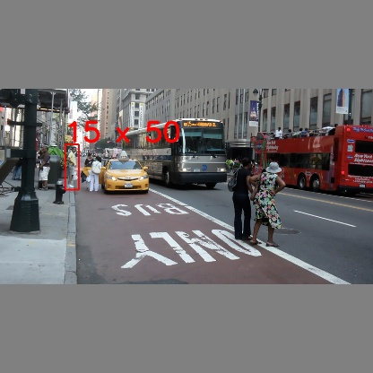

# Resize image, Keeping Aspect Ratio or not

在 Train model 時，前處理常常會需要將 image resize 成 model input 的 size，如 `YOLO` 的 `416x416`, `608x608` 等，這邊列舉幾種目前常見的 resize 方法，如下:

- Original image:

    
    

- Resized without keeping aspect ratio - `cv::resize()`

    
    

- `[Square Inference]` Resized with keeping aspect ratio - `letterbox_image()`

    
    

- `[Rectangular Inference]`Resized with keeping aspect ratio - `letterbox_rect_image()`

    
    

### 1. Resized without keeping aspect ratio - `cv::resize()`

直接對 image 進行 resize，使法改變了 image 的長寬比，image 會被拉伸。

在 [darknet - AB](https://github.com/AlexeyAB/darknet) 版本中就是使用此種前處理方式。

> image 被拉申後，對於訓練和測試效果上沒有影響，但 resized 可以使得目標尺寸變大，使得對於小目標檢測更加友好。

```python
new_image = cv2.resize(image, (new_w, new_h), interpolation=cv2.INTER_LINEAR)
```


### 2. [Square Inference] Resized with keeping aspect ratio - `letterbox_image()`

> Resizing image, `keeping the aspect ratio consistent`, and padding the left out areas with the color (128,128,128)

像信封一樣，將 image 在保持長寬比之下縮小，並且填充到一個固定大小的盒子內。

在原始 [darknet](https://github.com/pjreddie/darknet) 中就是使用此種前處理方式。

```python
h, w, _ = image.shape
desired_w, desired_h = size
scale = min(desired_w/w, desired_h/h)
new_w, new_h = int(w * scale), int(h * scale)

image = cv2.resize(image, (new_w, new_h), interpolation=cv2.INTER_LINEAR)
new_image = np.ones((desired_h, desired_w, 3), np.uint8) * 128

# Put the image that after resized into the center of new image
# 將縮放後的圖片放入新圖片的正中央
h_start = (desired_h - new_h) // 2
w_start = (desired_w - new_w) // 2
new_image[h_start:h_start+new_h, w_start:w_start+new_w, :] = image
```


### 3. [Rectangular Inference] Resized with keeping aspect ratio - `letterbox_rect_image()`

如上我們可以看到，在 `letterbox_image()` 的方法中，image 存在大量多餘的區域(padding area)，於是就想到能否去掉這些多餘的 padding area 且又要滿足長寬是 32 的倍數。

> Rectangular 思想: 去掉多餘 padding area，且長寬又滿足 32 的倍數


具體方法與 `letterbox_image()` 差不多:

1. 計算縮放比例。
2. 圖片按照比例縮放。較長邊為 416
3. 另一個比較短的邊進行最少的填充，使其滿足 32 的倍數

```python
h, w, _ = image.shape
desired_w, desired_h = size

# 1. Scale ration: (new / old)
scale = min(desired_w/w, desired_h/h)

# 2. Compute padding
new_w, new_h = int(w * scale), int(h * scale) # unpad size
pad_w, pad_h = desired_w - new_w, desired_h - new_h
if auto: # minimum rectangle
    # 取餘數操作，保證 padding 後的圖片是 32 (416x416) or 64 (512x512) 的整數倍
    pad_w, pad_h = np.mod(pad_w, 32), np.mod(pad_h, 32)

image = cv2.resize(image, (new_w, new_h), interpolation=cv2.INTER_LINEAR)

# Put the image that after resized into the center of new image
# 將縮放後的圖片放入新圖片的正中央
h_start = pad_h // 2
w_start = pad_w // 2
#new_image[h_start:h_start+new_h, w_start:w_start+new_w, :] = image
new_image = cv2.copyMakeBorder(image, h_start, h_start, w_start, w_start,
                               cv2.BORDER_CONSTANT, value=(128, 128, 128))
```


## Usage

```bash
$ python3 resize.py
```

## Reference

- [darknet-AB, Resizing : keeping aspect ratio, or not](https://github.com/AlexeyAB/darknet/issues/232)
- [YOLO網路圖像前處理的討論(resize or letterbox)](https://zhuanlan.zhihu.com/p/469436103)
- [ultralytics/yolov5](https://github.com/ultralytics/yolov5/blob/master/utils/augmentations.py)
