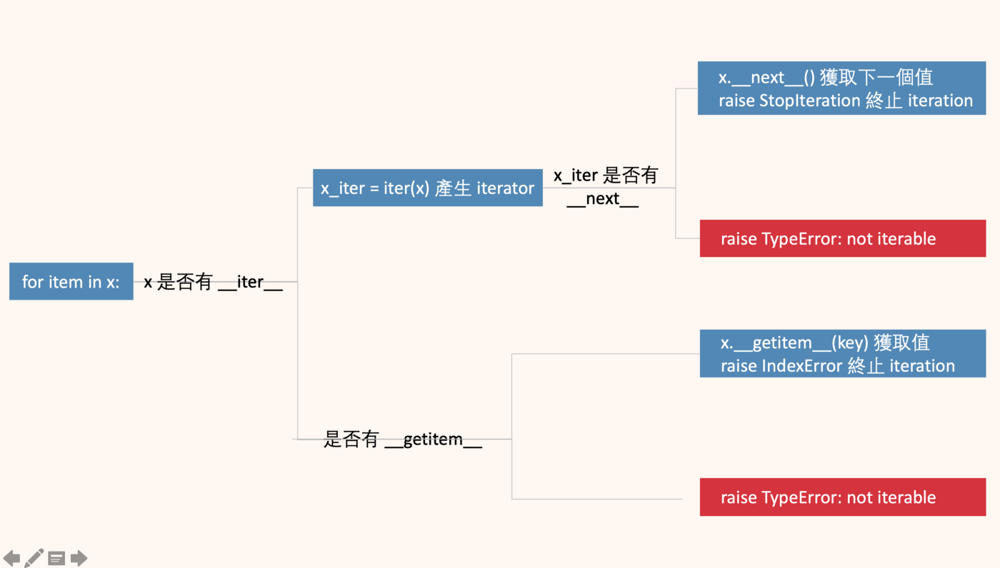

`Generator` functions allow you to declare a function that behaves like an `iterator`.

在開始介紹Generator前，先讓我們來看看Iterator。

## Iterator vs Iterable

- `Iteration`:

    當我們用一個循環(ex: for loop)遍歷一個容器(ex: list)裡面的所有元素時，就是迭代。

    Example:

    ```python
    nums = [1,2,3,4]
    for num in nums:
        print(num)
    ```

- `Iterable`: An iterable is an object that you can get an iterator from.

    可執行Iteration的物件都稱為Iterable，就是可以被`for loop`遍歷的物件。

    1. 在Python裡，只要在class裡實現了`__iter__`方法的物件都是`Iterable`物件。

        - `__iter__`: return an iterator object (需透過`iter()`變成iterator物件)

    2. 如果只實現了`__getitem__`方法，可以夠過`iter()`變成iterator物件，但不是Iterable物件。

        - `__getitem__`: can take `sequential` indexes starting from zero

- `Iterator`:

    根據[Iterator Protocol](https://docs.python.org/3.8/c-api/iter.html)，
    只要是實現了`__iter__`和`__next__`方法，的物件皆為`Iterator`。其中:

    - `__iter__`: 返回物件本身

    - `__next__`: 返回容器的下一個值，在沒有後續元素時拋出StopIteration Error

#### Note:

```
Every iterator is also an iterable, but not every iterable is an iterator.
```

list, dict, tuple, set, str都是Iterable，不是Iterator

### 檢查物件是不是Iterator或Iterable

使用`collections`模組中的`Iterable`,`Iterator`去檢查

```python
from collections import Iterable, Iterator

# list, dict, tuple, set, str都是Iterable，不是Iterator
print(isinstance([], Iterable), isinstance([], Iterator)) # True False
print(isinstance({}, Iterable), isinstance({}, Iterator)) # True False
print(isinstance((), Iterable), isinstance((), Iterator)) # True False
print(isinstance(set(), Iterable), isinstance(set(), Iterator)) # True False
print(isinstance('', Iterable), isinstance('', Iterator)) # True False
```

Output:

```
True False
True False
True False
True False
True False
```

### Iterable to Iterator

Created an iterator from an iterable by using the function `iter()`.


```python
x = [1, 2, 3]
print(isinstance(x, Iterable), isinstance(x, Iterator)) # True False

# iter()
iterator_x = iter(x)
print(isinstance(iterator_x, Iterable),
      isinstance(iterator_x, Iterator)) # True True

# use for loop or next()
'''
for i in iterator_x:
    print(i)
'''

print(next(iterator_x))
print(next(iterator_x))
print(next(iterator_x))
```

Output:

```
True False
True True
1
2
3
```

### For loop and Iterable object

當一個Iterable物件要能夠在for loop中，必須call `iter()`，
使其轉成Iterator物件，如下圖所示:



圖出處: [Python進階技巧 (6)](https://medium.com/citycoddee/python%E9%80%B2%E9%9A%8E%E6%8A%80%E5%B7%A7-6-%E8%BF%AD%E4%BB%A3%E9%82%A3%E4%BB%B6%E5%B0%8F%E4%BA%8B-%E6%B7%B1%E5%85%A5%E4%BA%86%E8%A7%A3-iteration-iterable-iterator-iter-getitem-next-fac5b4542cf4)

### Create an Iterable Object

有兩種方法:

1. class內實現`__iter__`方法

```python
object.__iter__(self)
```

2. class內實現`__getitem__`方法

```python
object.__getitem__(self,key)
```

- For sequence type, the accepted keys should be integers and slice objects.

#### Method 1:  Using the `__iter__` approach

```python
class MyIterator:
    def __init__(self, max_num):
        self.max_num = max_num

    def __iter__(self):
        """return an iterator object"""
        return iter(self.max_num)
```

```python
itr = MyIterator(10)
print(iter(itr))
```

Output:

```
---------------------------------------------------------------------------

TypeError
Traceback (most recent call last)

<ipython-input-4-3e7d0d770d4d> in <module>
      1 itr = MyIterator(10)
----> 2 print(iter(itr))


<ipython-input-3-2250d3b3d1b2> in __iter__(self)
      5     def __iter__(self):
      6         """return an iterator object"""
----> 7         return iter(self.max_num)


TypeError: 'int' object is not iterable
```

此時出現了錯誤，意思是MyIterator不能將"non-iterator type"轉成iter
這是因為我們class內成員(self.max_num)他是int type
不是iterable物件，所以我們只要將class成員改成iterable物件就可以了，
如下所示:

```python
class MyIterator:
    def __init__(self, num_list):
        self.num_list = num_list

    def __iter__(self):
        """return an iterator object"""
        return iter(self.num_list)
```

```python
_list = [1,2,3,4,5,6,7,8,9,10]
itr = MyIterator(_list)

print("Is iterable object? {} \nIs iterator object? {}\n".format(
    isinstance(itr, Iterable),
    isinstance(itr, Iterator))) # True False

for i in itr:
    print(i, end=', ')
```

#### Method 1:  Using the `__getitem__` approach

```python
class MyIterator:
    def __init__(self, num_list):
        self.num_list = num_list

    def __getitem__(self, key):
        if key < len(self.num_list):
            return self.num_list[key]
        else:
            raise IndexError
```

```python
_list = [1,2,3,4,5,6,7,8,9,10]
itr = MyIterator(_list)

print("Is iterable object? {} \nIs iterator object? {}\n".format(
    isinstance(itr, Iterable),
    isinstance(itr, Iterator))) # False False

for i in itr:
    print(i, end=', ')
```

### Create an Iterator Object

物件內實現`__iter__`和`__next__`方法

```python
class MyIterator:
    def __init__(self, max_num=20):
        self.max_num = max_num

    def __iter__(self):
        # Initialize: every time the iteration will start at 0
        self.index = 0
        return self

    def __next__(self):
        self.index += 1
        if self.index <= self.max_num:
            return self.index
        else:
            raise StopIteration
```

```python
my_itr = MyIterator()
print("Is iterable object? {} \nIs iterator object? {}\n".format(
    isinstance(itr, Iterable),
    isinstance(itr, Iterator))) # True True

for i in my_itr:
    print(i, end=', ')
```

### Exercise: Fibonacci Iterator

- [Fibonacci number](https://en.wikipedia.org/wiki/Fibonacci_number)

```
0, 1, 1, 2, 3, 5, 8, 13, 21, 34, 55, 89, 144, ...
```

```python
class FibonacciIterator:
    def __init__(self, n=10):
        self.n = n

    def __iter__(self):
        self.a = 0
        self.b = 1
        self.start = True
        self.count = self.n
        return self

    def __next__(self):
        if self.start:
            self.start = False
            return self.a
        elif self.count:
            self.count -= 1
            self.a, self.b = self.b, self.a + self.b
            return self.a
        else:
            raise StopIteration
```

```python
fib = FibonacciIterator()

for i in fib:
    print(i, end=' ')
```

## Generator

Generator使用方法跟Iterator一樣，每次迭代時會返回一個值，直到結束為止。
但相對Iterator，`Generator更優雅更方便且功能更強大`，算是一種特別的Iterator。

建立Generator有兩種方法:

- Function內包含至少一個以上的`yield`

    返回一個Generator object，需使用`next()`或是`for loop`取值


- 使用`Generator Expression`(生成器表達式)

    只要把`列表生成式的[]`改成`()`

### Create a Generator

#### 1. 基於yield的生成器

改寫上面的FibonacciIterator


```python
def fibonacci(n=10):
    index, a, b = 0, 0, 1
    while index <= n:
        yield a
        a, b = b, a + b
        index += 1

fib = fibonacci()
fib
```

Output:

```
<generator object fibonacci at 0x1096805d0>
```

```python
for x in fib:
    print(x, end=' ')
```

Output:

```
0 1 1 2 3 5 8 13 21 34 55
```

#### Generator Expression

```python
# List Comprehensions
my_list = [x * x for x in range(10)]
print(my_list)

my_generator = (x * x for x in range(10))
my_generator
```

Output:

```
[0, 1, 4, 9, 16, 25, 36, 49, 64, 81]
<generator object <genexpr> at 0x1097237d0>
```

```python
for x in my_generator:
    print(x, end=' ')
```

Output:

```
0 1 4 9 16 25 36 49 64 81
```

### Generator vs Iterator

In [PEP 255](https://www.python.org/dev/peps/pep-0255/), generator funtions are a special kind of function that return a [lazey iterator](https://en.wikipedia.org/wiki/Lazy_evaluation). These are objects that you can loop over like a list. However, unlike list, `lzay iterators do not store their contents in memory`.

- 不需要定義`__iter__`跟`__next__`，程式碼可讀性提高。
- 節省記憶體空間。因為Generator實現了lazy evaluation，當真的需要某個值的時候才真的去計算。

    ```
    當我們需要讀取某個資料，但資料很大且一開始我們僅僅需要訪問前面幾個元素時，
    如果這時我們建立一個list去存取它，不僅佔空間，且後面大多數元素佔的空間都白費了，
    這時可以建立一個Generator，然後再迴圈的過程中不斷的推算出後面的元素，
    這樣就可以節省大量空間。

    >>> 一邊迴圈/迭代一邊計算取值 -> Generator
    ```
- 調用方可以透過`send()`傳值進入Generator內。

#### Example: `send()`

```python
def gen(x, max=100):
    count = x
    while count<max:
        val = (yield count)
        if val is not None:
            count = val
        else:
            count += 1
```

```python
f = gen(5)

print(next(f))
print(next(f))
print(next(f))
print("=" * 15)
print(f.send(20))
for i in f:
    print(i, end=' ')
```

Output:

```
5
6
7
===============
20
21 22 23 24 25 26 27 28 29 30 31 32 33 34 35 36 37 38 39 40 41 42 43 44 45 46 47 48 49 50 51 52 53 54 55 56 57 58 59 60 61 62 63 64 65 66 67 68 69 70 71 72 73 74 75 76 77 78 79 80 81 82 83 84 85 86 87 88 89 90 91 92 93 94 95 96 97 98 99
```

## Reference

1. [Python進階技巧 (6)](https://medium.com/citycoddee/python%E9%80%B2%E9%9A%8E%E6%8A%80%E5%B7%A7-6-%E8%BF%AD%E4%BB%A3%E9%82%A3%E4%BB%B6%E5%B0%8F%E4%BA%8B-%E6%B7%B1%E5%85%A5%E4%BA%86%E8%A7%A3-iteration-iterable-iterator-iter-getitem-next-fac5b4542cf4)
2. [Python Iterators](https://www.w3schools.com/python/python_iterators.asp)
3. [Python Generators](https://www.programiz.com/python-programming/generator)
4. [iterator和generator雜談之二———懶惰的generator ](https://ithelp.ithome.com.tw/articles/10196328)
5. [Python生成器（Generator）和yield用法詳解](https://www.itread01.com/content/1543162922.html)
6. [How to Use Generators and yield in Python](https://realpython.com/introduction-to-python-generators/)
